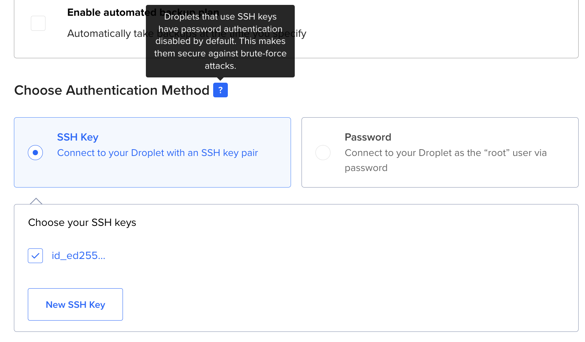

If you have issues with ssh, here are some troubleshooting ideas.

Prior to starting a new workflow... or returning to an old one after a while away, it's good to get an overview of what is happening between our ssh key on our laptop, vs. services like Github & DigitalOcean, which we access via ssh.

## Why we need ssh keys & how they work

When we try to ssh into a service, we're using our Private Key as our identity file (to prove our identity as "owner" of both keys-- that is, we originally created both and handed the public one to services we intend to connect to from our laptop), whereas the service we try to reach uses the Public Key we gave them to verify our login.

In more detail:

- When you try to connect, you have your private key (on your computer in ~/.ssh/)
- The server has your public key (which you previously uploaded/provided)
- The SSH protocol uses public key cryptography where:
  - The server sends you a challenge that can only be solved using your private key
  - Your SSH client uses your private key to solve this challenge
  - The server verifies the solution using your public key

## Github

- Add your ssh key via Account > Settings > Ssh & Gpg keys
- Run: `ssh -T git@github.com` to test the ssh connection.
-

## DigitalOcean

You can test your ability to reach DO via SSH in a very simple way:

When you create a new DigitalOcean droplet, it's initially set up with just the root user. The SSH key you selected will be added to root's authorized_keys.

- Add an ssh to your DO account via its Security dashboard
- Boot up a server from DO's web browser dashboard. If you can reach it via ssh, you can generally ssh into your DO account's servers.
- Run `ssh root@your-droplet-ip` to test logging into the newly booted server.

If those were both successful, then your ssh key apparently works & has been uploaded correctly.

Now you're ready to use that same ssh key via Terraform-- where, we're basically just automating the "add this ssh key to the server" which DO lets you do during Droplet Setup on its dashboard



```bash
ssh-keygen -t ed25519 -C "your.email@example.com" -f ~/.ssh/id_ed25519_gh_do_humanuser_020525
```
